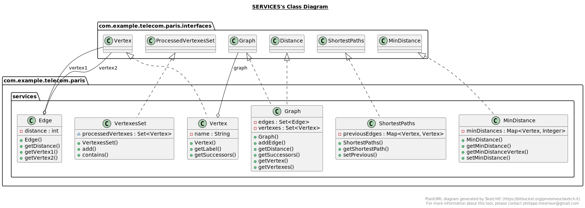
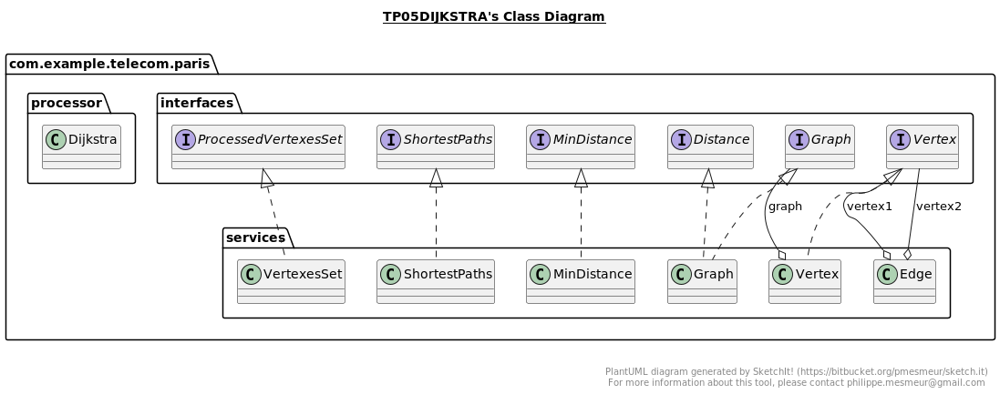
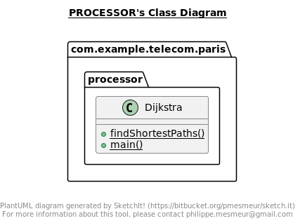

Nous allons programmer l’algorithme de Dijkstra servant à calculer le plus court chemin entre deux sommets d’un graphe
tel qu’illustré par la figure suivante. Chaque arc de ce graphe est caractérisé par une valeur représentant la distance
entre les deux sommets qu’il relie.

JavaDoc => 